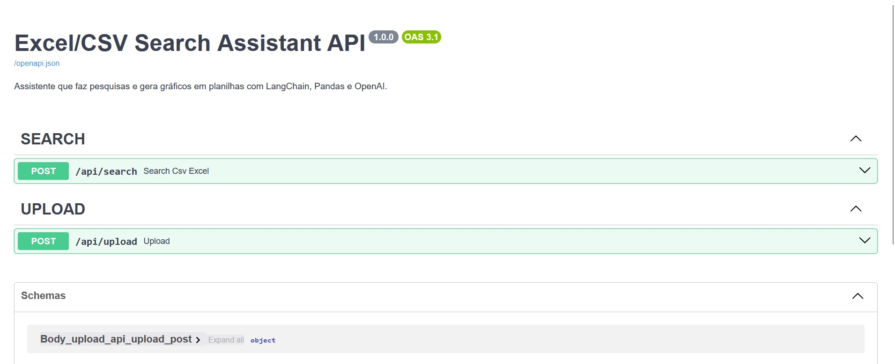
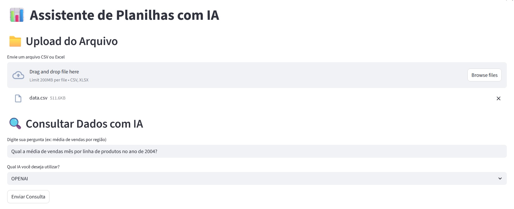
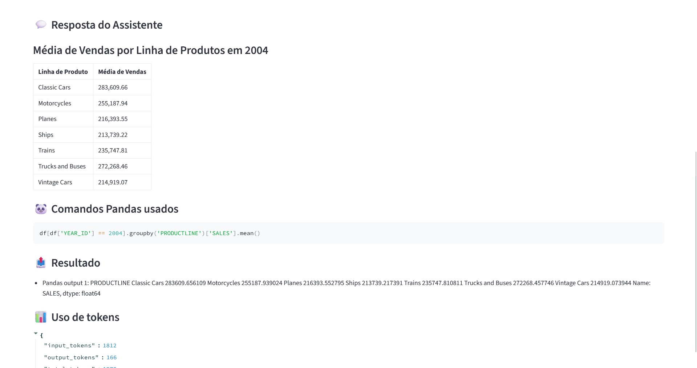
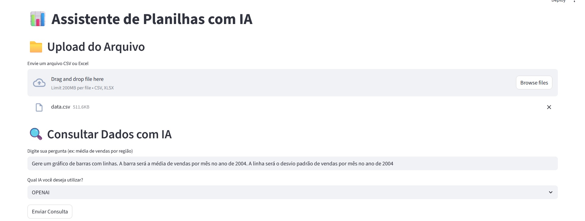
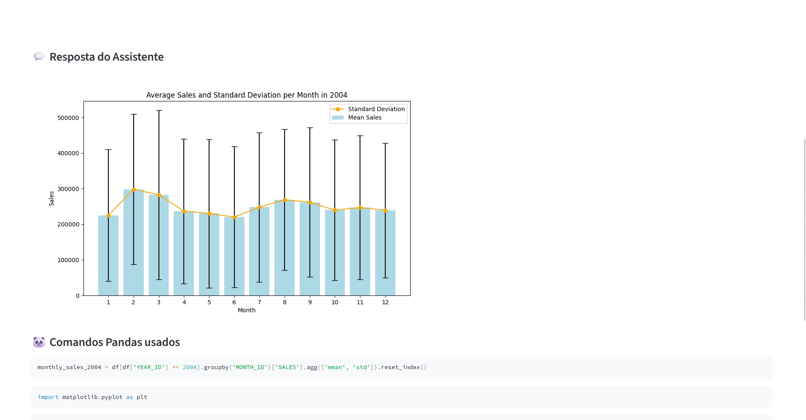

# 🤖 AI CSV Excel Search Assistant

Um assistente de IA que realiza **pesquisas inteligentes** e **gera gráficos automaticamente** com base em planilhas `.csv` e `.xlsx`.  
Ideal para análises automatizadas de dados, visualização e exploração de insights — tudo por meio de uma **API desenvolvida com FastAPI**.

---

## ✨ Tecnologias Utilizadas

- **Python 3.10+**
- **FastAPI** – API rápida e moderna
- **LangChain** – Cadeias de raciocínio com LLMs
- **OpenAI** – Geração de linguagem natural - trabalhado modelo **gpt-4o-mini**
- **Pandas** – Manipulação de dados
- **Matplotlib & Seaborn** – Geração de gráficos e visualizações

---

## 📦 Instalação

Tem duas formas de instalar e rodar o projeto:

1. Manualmente através de um ambiente virtual, instalação de dependências e execução dos projetos
2. Via docker-compose

---

### 01. Variáveis de ambiente

Crie um arquivo .env na raiz do projeto e preencha as variáveis abaixo com suas respectivas keys:

```
OPENAI_KEY=sk-...
OPENAI_MODEL=gpt-4o-mini
AZURE_OPENAI_KEY=key
AZURE_OPENAI_URL=https://{your-azure-host}.openai.azure.com/
AZURE_OPENAI_MODEL=o4-mini
AZURE_OPENAI_API_VERSION=2025-01-01-preview
```

---

### 02. Instalação e execução manual

```bash
git clone https://github.com/seu-usuario/seu-repo.git
cd seu-repo
python -m venv venv
source venv/bin/activate  # ou venv\Scripts\activate no Windows
pip install -r requirements.txt
```

---

### 03. Instalação via Docker

```bash
docker-compose up --build -d
```

### 04. Acessando as aplicações

#### ▶️ Como rodar a API

```bash
uvicorn app:app --reload
```

Acesse a documentação interativa em:
👉 [http://localhost:8000/docs](http://localhost:8000/docs)

API Docs



## ▶️ Como rodar o front-end com Streamlit

```bash
streamlit run frontend/streamlit_app.py
```

Acesse a aplicação interativa em:
👉 [http://localhost:8501](http://localhost:8501)

Página inicial



---

## 🧠 Funcionalidades da API

### 🔍 `/api/search`

**Descrição:**
Executa uma consulta em uma planilha já enviada, interpretando a requisição com um LLM e retornando insights e gráficos.

**Método:** `POST`
**Body (JSON):**

```json
{
  "query": "qual a média de vendas por região?",
  "file_name": "vendas_abril.csv",
  "file_delimiter": ";"
}
```

**Resposta esperada de sucesso:**

```json
{
  "type": "TEXT",
  "image_path": null,
  "pandas_commands": [
    "df[(df['YEAR_ID'] == 2003) & (df['MONTH_ID'] == 5)]['SALES'].mean()"
  ],
  "pandas_output": 198790.3448275862,
  "llm_output": "A média de vendas em 2003 e no mês de Maio é **198790.34**.",
  "usage": {
    "input_tokens": 1987,
    "output_tokens": 69,
    "total_tokens": 2056
  },
  "error_msg": null
}
```

**Resposta esperada de falha:**

```json
{
  "image_path": null,
  "pandas_commands": [
    "monthly_sales = df[df['YEAR_ID'] == 2003].groupby(['MONTH_ID', 'PRODUCTLINE'])['SALES'].mean().unstack()",
    "import seaborn as sns; import matplotlib.pyplot as plt; ax = monthly_sales.plot(kind='bar', figsize=(12, 6)); ax.set_title('Média de Vendas por Mês e Produto em 2003'); ax.set_xlabel('Mês'); ax.set_ylabel('Média de Vendas'); for p in ax.patches: ax.annotate(round(p.get_height(), 2), (p.get_x() + p.get_width() / 2., p.get_height()), ha='center', va='bottom'); plt.savefig('files/plots/c14f9957-df44-4531-b1dc-2c96c174efae.png')"
  ],
  "pandas_output": null,
  "llm_output": null,
  "usage": {
    "input_tokens": 1917,
    "output_tokens": 193,
    "total_tokens": 2110
  },
  "error_msg": "invalid syntax (<string>, line 1)"
}
```

---

### 📁 `/api/upload`

**Descrição:**
Realiza o upload de um arquivo `.csv` ou `.xlsx` para posterior análise.

**Método:** `POST`
**Body (form-data):**

* `file`: Arquivo da planilha

**Resposta esperada:**

```json
{
  "file_id": "uuid-gerado",
  "message": "Arquivo enviado com sucesso!",
  "file_path": "files/vendas_abril.csv"
}
```

---

## 📂 Estrutura do Projeto (simplificada)

```

.
├── app.py                                  # Arquivo principal que inicializa a FastAPI
├── .env                                    # Variáveis de ambiente
├── .gitignore
├── README.md
├── requirements.txt

├── src/
│   ├── llm/                                # Integração com LLMs (LangChain/OpenAI)
│   │   ├── llm\_integration.py             # Setup e comunicação com o modelo de linguagem
│   │   └── prompts.py                      # Prompt engineering e templates
│   ├── models/                             # Schemas (Pydantic) para entrada e saída da API
│   │   ├── dataframe.py
│   │   ├── endpoint.py
│   │   └── llm\_models.py
│   ├── routes/                             # Rotas da API
│   │   ├── search\_route.py                # Rota de busca e análise
│   │   └── upload\_route.py                # Rota de upload de planilhas
│   ├── services/                           # Lógica de negócio
│   │   ├── command\_service.py             # Executa comandos baseados no input do LLM
│   │   ├── dataframe\_info\_service.py     # Extrai informações básicas da planilha
│   │   ├── llm\_service.py                 # Camada de serviço para LLM
│   │   ├── pandas\_processor\_service.py   # Interpreta e executa código Pandas
│   │   ├── upload\_service.py              # Lida com arquivos recebidos
│   │   └── user\_intention\_service.py     # Determina a intenção do usuário via IA
│   └── utils/
│       └── file\_utils.py                  # Utilitários para lidar com arquivos

```

---

### Demonstrações

#### 1. Análises textuais do dataset

1. **Pergunta**


2. **Resposta**



---

#### 2. Geração de gráficos

1. **Pergunta**



2. **Resposta**



---

#### 3. Vídeo demonstrativo

<video width="1920" height="1080" controls>
  <source src="docs/demo_video.mp4" type="video/mp4">
</video>

---

## 📄 Licença

Este projeto está licenciado sob a licença [MIT](LICENSE).

---

## ✍️ Autor

**Victor Hugo Negrisoli**
🔗 [LinkedIn](https://www.linkedin.com/in/victorhugonegrisoli/) | 🐙 [GitHub](https://github.com/vhnegrisoli/)